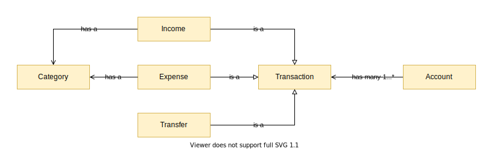
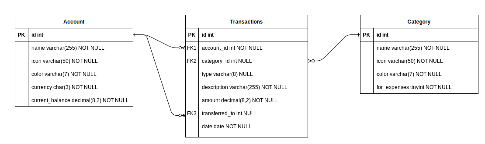

# Managing personal finances

[TOC]

## Requirements

- The program will be use by a single user.
- The user can organize its money in different accounts.
- The user can record expenses.
- The user can record incomes.
- The user can record transfers between accounts.
- The user can categorized incomes an expenses, but not transfers.
- Every account has to have an icon an a color.
- Every category has to have an icon an a color.
- Categories for expenses and incomes are different.

## Design

### Accounts

First, let us consider `accounts` as places where money is stored.
Money storage can take many forms including bank accounts, electronic accounts (like PayPal), Bitcoin wallets, bed underside's and so on.
Not just that, but we could have multiple iterations of these forms of storage (multiple Bank Accounts for example).
The system though, does not need to know this.
Separating between form simply means creating another account.

Note that the concept of _money storage is broad_ and the boundaries between accounts are defined by the user.
I could consider all the cash I have hiding in multiple places around my apartment a single account named _Emergency money_, but the jar in the living room is my _Going to Paradise Fall's trip savings_ (Pixar's _Up_ reference).
Maybe I consider each account in a bank as single entities, but not in another one.
The user has to give a minimal amount of though about organization.

### Balance

Also, accounts have a `balance` that shows how much money the account has and `total balance` which is the sum of the balances of all the accounts.
This quantities will be positive most of the time, but there is no restriction in place to prevent users from subtracting more money than they have stored.
This can be used to show a debt towards something for example.

### Transactions

_What happened to my money?_ is the main question this type of app should help the user answer.
This notion at the heart of the system of the exchange of money will be define as `transaction`.
They have data like description, amount, date and associated account.

However, showing movement alone is not enough.
`Transactions` have _direction_.
Money can flow towards the user or away from them.
To reflect this, `transactions` that add money to the `total balance` of the user will be`incomes` and the ones that do the opposite will be `expenses`.
I deliberately define these around adding or subtracting to the `total balance` and not specific accounts.
The reason being that there is a third type of movement.
When we move money from one account to another (as when using an ATM), the total balance remain the same.
This type of transaction is called `transfer`.

An alternative design could be recording `transfers` implicitly as two `transactions`: an `expense` and an `income`.
The user has to be _smart_ about it.
They need to develop a convention for describing and linking at a glance these two `transactions`.
It is more prone to human error.
I choose the design that makes a this operation explicit and obvious.

### Categories

Having description for a `transaction` lets you know that you spent 29.99$ last saturday on games, but do not allow to see how many time or how much money that has happened in certain period of time.
This is what allows one to track expenses.
I could by one type of snack today and another tomorrow, but both expense were done for snacking purposes.
To encode this _common reason_, we have the notion of `categories`.

`Categories` are no more than a way of grouping transactions in similar buckets.
The user can create as many as they like to organize themselves.
Also, the system will allow `categories` for `incomes`, so that the user can not just answer _Where is my money going?_ but also _Where is my money coming from?_
This is not usually a mystery for must people, but it is nevertheless useful for some.
Income categories and expense categories are different since it does not make sense, for example, to share `Food` as a category for both.

Also, transfers do not have categories.
I see no use case for they to have such attribute.
If you `transfer` money from your _Bank ABC account_ to your _Wallet_ via an ATM for _stealthily_ buying something, then the reason for spending the money will be recorded in the `expense` of the _Wallet_.

### Current balance

There are two approaches to produce the balance:
- compute the current balance for each account every time it is needed and
- keep the current balance stored with the account and modify it every time a transaction involving the account is done.

The first approach means less work when writing, since there is no need to check if the account will overdraft, and more work when reading since the balance has to be computed on every read.
The second approach means more work when writing, since we have to be sure that every operation that touches a transaction also updates the balance as a single unit of work, and less work when reading since the balance is already there.

The application is meant as both a test and for personal use.
Either one of the options is good for this use case.
I prefer to have the balances ready at hand so I choose the later.

## Diagrams

### Design

Here we have a basic diagram for the design.

### Storage

For storage, I squashed all the transactions in one table and use the `transactions.type` column to tell them apart.
Which means I do not have to unite them when querying all the transactions that happened in a period, but it is still simple to filter them by type.

## Design short-comings

By no means a complete list:

- There is no explicit way of expressing fees for transferring funds between accounts.
